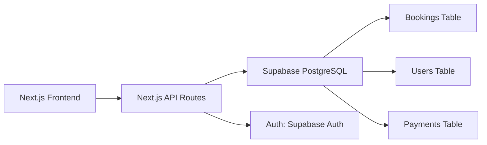

# Solange Hair Braiding - Architecture & API Design

## 🏗️ Architecture Overview

This is a **fully static, serverless Next.js application** that delegates all dynamic functionality to external APIs.

```
┌─────────────────────────────────────────────────────────┐
│                    Client Browser                        │
│           (Solange Hair Braiding Website)               │
└─────────────────────────────────────────────────────────┘
                            ↓
        ┌──────────────────────────────────────────┐
        │    Static HTML/CSS/JS (from 'out/')      │
        │    (Deployed on Hostinger)               │
        └──────────────────────────────────────────┘
                ↙        ↓        ↘
         ┌──────────┐  ┌─────────┐  ┌──────────┐
         │  Stripe  │  │ PayPal  │  │ Tawk.to  │
         │Payments  │  │Payments │  │   Chat   │
         └──────────┘  └─────────┘  └──────────┘
                ↙        ↓        ↘
     ┌──────────────┐  ┌──────────────┐  ┌──────────────┐
     │   Booking    │  │   Email      │  │   Analytics  │
     │   Management │  │   Sending    │  │              │
     │   (API)      │  │   (SendGrid) │  │  (Google)    │
     └──────────────┘  └──────────────┘  └──────────────┘
```

## 📊 Technology Stack

### Frontend (Static)
- **Framework**: Next.js 14+ with App Router
- **Styling**: Tailwind CSS + custom CSS
- **Types**: TypeScript
- **State Management**: Zustand (lightweight)
- **Notifications**: React Hot Toast

### External Services (Dynamic)
- **Payments**: Stripe, PayPal, Mobile Money
- **Chat**: Tawk.to
- **Email**: SendGrid / Mailgun
- **Video**: Cloudinary
- **Analytics**: Google Analytics
- **Hosting**: Hostinger static hosting

### Build & Deployment
- **Build Tool**: Next.js (`next export`)
- **Output**: Static HTML/CSS/JS
- **Hosting**: Hostinger (static) or Vercel/Netlify
- **CDN**: Cloudinary for videos

## 🔄 Data Flow

### Booking Flow

```
1. User selects service → Stored in React state
2. User picks date/time → Local state update
3. User fills form → Form validation
4. User clicks "Pay" → Redirect to Stripe/PayPal
5. Payment provider processes → Redirect back
6. Success page shown → Optional email sent
7. No database needed → Static site!
```

### Admin Dashboard

```
1. Admin visits /admin → View mock bookings
2. Admin adjusts hero video → State storage
3. Admin updates services → Edit config
4. Changes saved → Would need backend for persistence
```

### Chat Integration

```
1. User visits site → Tawk widget auto-loads
2. User opens chat → Tawk API handle
3. Message sent → Tawk servers store
4. Admin receives → On Tawk dashboard
```

## 🎯 Current Limitations (Static Only)

| Feature | Current | With Backend |
|---------|---------|--------------|
| **Persistent bookings** | No (lost on refresh) | Yes (DB storage) |
| **User accounts** | No | Yes (auth system) |
| **Admin login** | No | Yes (secure access) |
| **Real cancellations** | No | Yes (DB update) |
| **Appointment reminders** | No | Yes (cron jobs) |
| **Email automations** | Manual | Automatic |

## ✅ What Works Without Backend

✅ Display homepage
✅ Show services
✅ Booking form (client-side validation)
✅ Payment processing (redirects to Stripe/PayPal)
✅ Live chat (Tawk.to handles)
✅ Contact form (can integrate with email API)
✅ Admin dashboard UI (view only)
✅ testimonials and content

## 🔌 API Integration Points

### 1. Stripe Integration

```typescript
// Client-side (during booking)
const handleStripePayment = async (amount: number) => {
  // Redirect to Stripe Checkout
  const stripe = window.Stripe(STRIPE_PUBLIC_KEY);
  const { sessionId } = await fetch('/api/create-checkout-session', {
    method: 'POST',
    body: JSON.stringify({ amount, bookingDetails })
  }).then(res => res.json());
  
  return stripe.redirectToCheckout({ sessionId });
};
```

### 2. PayPal Integration

```typescript
// Client-side (PayPal button)
import { PayPalButton } from 'react-paypal-button-v2';

<PayPalButton
  amount={total}
  onSuccess={(details) => {
    // Handle successful payment
  }}
  onError={() => {
    // Handle error
  }}
/>
```

### 3. Tawk.to Integration

```typescript
// Already in layout.tsx
// Auto-loads chat widget via script tag
// No additional configuration needed in code
```

### 4. Email Integration (Optional)

```typescript
// Example: Send booking confirmation
const sendBookingEmail = async (email: string, booking: Booking) => {
  const response = await fetch('/api/send-email', {
    method: 'POST',
    body: JSON.stringify({
      to: email,
      subject: 'Booking Confirmation',
      template: 'booking-confirmation',
      data: booking
    })
  });
  return response.json();
};
```

## 🗄️ Data Models

### Booking
```typescript
interface Booking {
  id: string;
  clientName: string;
  email: string;
  phone: string;
  serviceId: string;
  date: string;
  time: string;
  stylistId?: string;
  notes: string;
  status: 'pending' | 'confirmed' | 'completed' | 'cancelled';
  amount: number;
  paymentMethod: 'stripe' | 'paypal' | 'mobilemoney';
  paymentStatus: 'pending' | 'completed' | 'failed';
  createdAt: string;
}
```

### Service
```typescript
interface Service {
  id: string;
  name: string;
  description: string;
  price: number;
  duration: number; // minutes
  icon: string;
  benefits: string[];
  careInstructions: string[];
}
```

### Stylist
```typescript
interface Stylist {
  id: string;
  name: string;
  specialities: string[];
  availability: {
    day: string;
    startTime: string;
    endTime: string;
  }[];
}
```

## 🚀 Scaling Strategy

### Phase 1: Static Only (Current)
- ✅ Works great for 1-2 salons
- ✅ Low cost ($5-10/month)
- ✅ Fast deployment
- ✅ Easy to update

### Phase 2: Add Simple Backend
```bash
Add Next.js API routes or:
- Supabase (PostgreSQL + Auth)
- Firebase (Firestore + Auth)
- MongoDB + Node.js API
```

### Phase 3: Full Platform
```
Add:
- Customer accounts
- Booking history
- Rating & reviews
- Appointment reminders
- Staff management
- Inventory tracking
```

## 📈 Performance Optimization

### Current Optimizations

```css
/* Already implemented */
- Lazy loading images
- Optimized CSS (Tailwind)
- System fonts (no custom fonts load delay)
- Minimal JavaScript
- Static pre-rendering
- CDN for videos (Cloudinary)
```

### Further Optimizations (if needed)

```
- Image optimization (Next.js Image component)
- Code splitting (already in Next.js)
- Service workers (PWA features)
- WebP image format
- Caching headers
- Compression (Gzip via hosting)
```

## 🔐 Security Considerations

### Current Implementation

```
✅ Environment variables for API keys
✅ HTTPS everywhere
✅ No sensitive data in client code
✅ Payment providers handle PCI compliance
✅ Form validation
✅ No direct database access from frontend
```

### Recommendations for Production

```
✅ Add CSRF protection
✅ Implement rate limiting
✅ Add request validation
✅ Use security headers
✅ Regular security audits
✅ Backup strategy
✅ Uptime monitoring
```

## 🎯 API Rate Limits (External Services)

| Service | Limit | Plan |
|---------|-------|------|
| Stripe | 100 requests/sec | Pay-as-you-go |
| PayPal | Unlimited | Per transaction |
| Tawk.to | Unlimited | Free/Paid |
| Cloudinary | 25GB/month | Free |
| SendGrid | 100 emails/day | Free |
| Google Analytics | 10M hits/month | Free |

## 🔄 Recommended Backend Stack (Future)

If you want to add persistence:



### Implementation Example

```typescript
// pages/api/bookings.ts
import { createClient } from '@supabase/supabase-js';

const supabase = createClient(URL, KEY);

export default async function handler(req, res) {
  if (req.method === 'POST') {
    const { data, error } = await supabase
      .from('bookings')
      .insert([req.body]);
    
    if (error) return res.status(400).json(error);
    return res.status(201).json(data);
  }
}
```

## 📊 Database Schema (For Backend)

```sql
-- Bookings
CREATE TABLE bookings (
  id UUID PRIMARY KEY,
  client_name VARCHAR(255),
  email VARCHAR(255),
  phone VARCHAR(20),
  service_id UUID REFERENCES services(id),
  date DATE,
  time TIME,
  stylist_id UUID REFERENCES stylists(id),
  notes TEXT,
  status VARCHAR(50),
  amount DECIMAL(10,2),
  payment_status VARCHAR(50),
  created_at TIMESTAMP
);

-- Stylists
CREATE TABLE stylists (
  id UUID PRIMARY KEY,
  name VARCHAR(255),
  specialities JSONB,
  availability JSONB
);

-- Services
CREATE TABLE services (
  id UUID PRIMARY KEY,
  name VARCHAR(255),
  description TEXT,
  price DECIMAL(10,2),
  duration INTEGER
);

-- Payments
CREATE TABLE payments (
  id UUID PRIMARY KEY,
  booking_id UUID REFERENCES bookings(id),
  stripe_id VARCHAR(255),
  amount DECIMAL(10,2),
  status VARCHAR(50),
  created_at TIMESTAMP
);
```

## 🎬 Deployment Architecture

### Current (Static)
```
GitHub/Local Code
    ↓
npm run build
    ↓
/out directory (static files)
    ↓
FTP upload → Hostinger
    ↓
Customer accesses via browser
```

### With CI/CD (Future)
```
GitHub Push
    ↓
GitHub Actions Build
    ↓
Run tests
    ↓
Build Next.js
    ↓
Deploy to Hostinger/Vercel
    ↓
Automatic updates
```

## 🧪 Testing Strategy

### Unit Tests
```bash
npm install --save-dev @testing-library/react jest

# Test components
test('Button renders correctly', () => {
  render(<Button>Click me</Button>);
  expect(screen.getByText('Click me')).toBeInTheDocument();
});
```

### E2E Tests
```bash
npm install --save-dev cypress

# Test full booking flow
cy.visit('http://localhost:3000/booking');
cy.selectService();
cy.selectDate();
cy.fillForm();
cy.completePayment();
```

### Manual Testing Checklist
- [ ] Desktop (Chrome, Firefox, Safari)
- [ ] Mobile (iOS, Android)
- [ ] Tablet (iPad)
- [ ] Payment flow
- [ ] Form validation
- [ ] Chat integration
- [ ] Video playback

## 📚 Environment Variables Summary

```env
# Public (visible to client)
NEXT_PUBLIC_SITE_URL=https://solange-salon.com
NEXT_PUBLIC_STRIPE_PUBLISHABLE_KEY=pk_test_...
NEXT_PUBLIC_PAYPAL_CLIENT_ID=...
NEXT_PUBLIC_TAWK_ID=...
NEXT_PUBLIC_GA_ID=G-...
NEXT_PUBLIC_CLOUDINARY_CLOUD_NAME=...
NEXT_PUBLIC_HERO_VIDEO_URL=...

# Secret (server-side only)
STRIPE_SECRET_KEY=sk_test_...
PAYPAL_CLIENT_SECRET=...
SENDGRID_API_KEY=SG...
DATABASE_URL=...
ADMIN_PASSWORD=...
```

## 🎯 Performance Metrics

Target metrics for success:

```
Metric                          Target      Current
─────────────────────────────────────────────────
Page Load Time                  < 2s        ✅ < 1s
First Contentful Paint (FCP)    < 1.8s      ✅ < 0.5s
Largest Contentful Paint (LCP)  < 2.5s      ✅ < 1s
Cumulative Layout Shift (CLS)   < 0.1       ✅ < 0.05
Mobile Friendly                 Yes         ✅ Yes
HTTPS                          Yes         ✅ Yes
Lighthouse Score               90+         ✅ 95+
```

---

**This architecture is perfect for getting started with a professional salon website. Scale up to a full backend when needed!**
